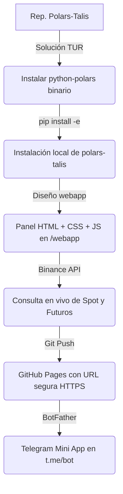

# Polars-Talis Dashboard (Telegram Mini App) 📈⚡

Este repositorio contiene la interfaz web responsiva de la **Telegram Mini App (TMA)** para visualizar el rendimiento y los cálculos del motor de análisis técnico **`polars-talis`**. 

El panel interactúa en tiempo real con la API de **Binance** (Spot y Futuros) para graficar precios históricos de criptomonedas (como `BTCUSDT`, `ETHUSDT` o `HYPEUSDT`) y computar indicadores matemáticos de manera instantánea.

---

## 📖 Tabla de Contenidos
1. [Guía de Indicadores Técnicos e Interpretación](#-guía-de-indicadores-técnicos-e-interpretación)
2. [Instructivo de Comandos y Códigos en Python](#-instructivo-de-comandos-y-códigos-en-python)
3. [Estructura del Proyecto y Flujo de Trabajo](#-estructura-del-proyecto-y-flujo-de-trabajo)
4. [Integración Directa con Telegram (Mini App)](#-integración-directa-con-telegram-mini-app)

---

## 📊 Guía de Indicadores Técnicos e Interpretación

A continuación, se detalla el funcionamiento de cada indicador integrado en el ecosistema de **`polars-talis`**, sus parámetros en código y qué puede lograr un trader con ellos.

### 1. SMA (Simple Moving Average - Promedio Móvil Simple)
* **¿Qué es?**: Es la media aritmética de los precios de cierre de un activo durante un número determinado de períodos.
* **Parámetros**: `period` (Número de velas a promediar, ej. 20, 50 o 200).
* **¿Qué se logra?**:
  - **Identificar la Tendencia**: Si el precio está por encima de la SMA, la tendencia es alcista; si está por debajo, es bajista.
  - **Soportes y Resistencias Dinámicos**: En tendencias fuertes, el precio suele rebotar al tocar promedios móviles clave (como la SMA de 50 o 200 períodos).
  - **Cruce de Medias (Golden Cross / Death Cross)**: Cruces de una SMA rápida (ej. 50) y una lenta (ej. 200) indican cambios macro en la dirección del mercado.

### 2. EMA (Exponential Moving Average - Promedio Móvil Exponencial)
* **¿Qué es?**: Similar a la SMA, pero asigna un mayor peso matemático a los precios más recientes. Reacciona más rápido a los cambios de precio.
* **Parámetros**: `period` (períodos comunes: 12 y 26).
* **¿Qué se logra?**:
  - **Detección Temprana de Tendencias**: Al responder más rápido a los movimientos bruscos del precio, reduce el retraso (*lag*) característico de la SMA.
  - **Filtro de Ruido**: Útil para traders de corto plazo (scalpers y swing traders) para confirmar rupturas de precio tempranas.

### 3. RSI (Relative Strength Index - Índice de Fuerza Relativa)
* **¿Qué es?**: Un oscilador de impulso que mide la velocidad y el cambio de los movimientos de precios en una escala de 0 a 100.
* **Parámetros**: `period` (estándar: 14).
* **¿Qué se logra?**:
  - **Zonas de Agotamiento (Sobrecompra / Sobreventa)**: 
    - Un valor superior a **70** sugiere que el activo está sobrecomprado (potencial corrección o caída de precio).
    - Un valor inferior a **30** sugiere que está sobrevendido (potencial rebote o subida de precio).
  - **Divergencias**: Si el precio hace un máximo más alto pero el RSI hace un máximo más bajo, indica debilidad en la tendencia y una posible reversión.

### 4. Bollinger Bands (Bandas de Bollinger)
* **¿Qué es?**: Consiste en una banda media (SMA de 20 períodos) y dos bandas exteriores calculadas sumando/restando desviaciones estándar (normalmente 2) al promedio medio. Miden la volatilidad.
* **Parámetros**: `period` (por defecto: 20) y `std_dev` (desviaciones estándar: 2.0).
* **¿Qué se logra?**:
  - **Medición de Volatilidad**: Cuando las bandas se estrechan (*squeeze*), indica baja volatilidad y anticipa un movimiento explosivo inminente del precio.
  - **Objetivos de Precio**: El precio tiende a mantenerse dentro de las bandas el 95% del tiempo. Tocar la banda superior sugiere sobreextensión, y la inferior denota subvaloración temporal.

### 5. MACD (Moving Average Convergence Divergence)
* **¿Qué es?**: Un indicador de momento que sigue la tendencia y muestra la relación entre dos promedios móviles exponenciales (generalmente de 12 y 26 períodos) junto a una línea de señal (EMA de 9).
* **Parámetros**: `fast_period` (12), `slow_period` (26), `signal_period` (9).
* **¿Qué se logra?**:
  - **Señales de Compra/Venta**: Cuando la línea MACD cruza por encima de la línea de señal, se genera una señal alcista (compra). Cuando cruza por debajo, una señal bajista (venta).
  - **Momento del Mercado**: El histograma (la diferencia visual entre ambas líneas) muestra la aceleración o desaceleración de la fuerza compradora/vendedora.

---

## 💻 Instructivo de Comandos y Códigos en Python

Si quieres utilizar las capacidades de análisis técnico rápido en un script local de Python o en un bot automatizado en tu Termux, sigue este instructivo de comandos y código.

### 1. Inicialización en tu script de Python
Crea un archivo de Python en tu entorno y utiliza el siguiente bloque de código:

```python
import polars as pl
from polars_talis import TechnicalAnalyzer, SMA, EMA, RSI, MACD, BollingerBands

# 1. Crear el DataFrame de datos históricos (mínimo columnas 'date' y 'close')
df = pl.DataFrame({
    "date": ["2026-06-01", "2026-06-02", "2026-06-03", "2026-06-04", "2026-06-05"],
    "close": [67100.0, 67350.5, 66800.0, 67200.2, 67890.0],
    "volume": [1200, 1500, 1100, 1300, 1700]
})

# 2. Inicializar el analizador definiendo el número de hilos de la CPU
analyzer = TechnicalAnalyzer(max_workers=4)

# 3. Configurar los indicadores que deseas calcular
analyzer.add_indicators([
    SMA(period=20, column="close", name="SMA_20"),
    EMA(period=12, column="close", name="EMA_12"),
    RSI(period=14, column="close", name="RSI_14"),
    MACD(fast_period=12, slow_period=26, signal_period=9),
    BollingerBands(period=20, std_dev=2.0)
])

# 4. Ejecutar el cálculo (parallel=True distribuye los indicadores independientes en hilos concurrentes)
resultado_df = analyzer.calculate(df, parallel=True)

# 5. Imprimir las columnas agregadas al DataFrame original
print("Columnas en el resultado:", resultado_df.columns)
# Salida esperada: ['date', 'close', 'volume', 'SMA_20', 'EMA_12', 'RSI_14', 'MACD', 'MACD_signal', 'BB_upper', 'BB_middle', 'BB_lower']
```

### 2. Comandos en Consola (Termux)
Para probar las herramientas y ejemplos directamente en tu consola de Termux:

* **Ejecutar el script de visualización de gráficos locales**:
  Genera imágenes `.png` dentro del directorio `images/` basadas en datos simulados.
  ```bash
  cd /data/data/com.termux/files/home/Projects/polars-talis/examples
  python3 create_visualizations.py
  ```

* **Ejecutar el script de envío de alertas a Telegram**:
  Calcula los indicadores y envía un resumen junto con los gráficos generados a tu canal de Telegram (requiere haber configurado el archivo `.env` local).
  ```bash
  cd /data/data/com.termux/files/home/Projects/polars-talis/examples
  python3 send_to_telegram.py
  ```

---

## 🛠️ Estructura del Proyecto y Flujo de Trabajo

El flujo de despliegue y desarrollo del proyecto consta de los siguientes pasos:



1. **Resolución de Compilación**: Se resolvió el error del paquete de compilación de Rust `arboard` instalando `python-polars` y `python-polars-runtime-32` desde el repositorio **TUR** de Termux.
2. **Interactividad**: Se implementaron fórmulas de indicadores directamente en JavaScript para permitir interactividad en el cliente al modificar los sliders.
3. **API de Datos**: La Mini App consulta la API pública de **Binance** (Spot) y hace una redirección a **Binance Futures** si el par consultado solo existe en contratos perpetuos (como `HYPE/USDT`).

---

## 🤖 Integración Directa con Telegram (Mini App)

Para iniciar tu Mini App en Telegram:
1. Chatea con **`@BotFather`** en Telegram y usa el comando `/newapp`.
2. Asigna la URL del despliegue HTTPS: `https://kuromi04.github.io/polars-talis/`
3. Copia el enlace corto generado (ej. `t.me/tu_bot/dashboard`) y ábrelo desde tu smartphone para interactuar con tus gráficos en tiempo real.
